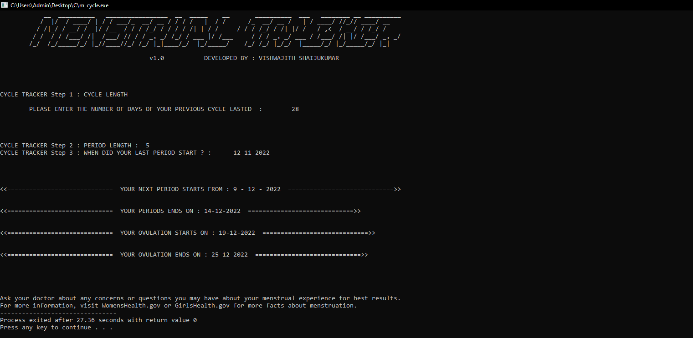

# menstrual-tracker

<h1 style="font-family: cursive;">Menstrual-Tracker 🩸🩺</h1>   <a target="_blank" rel="noopener noreferrer" href="https://camo.githubusercontent.com/e92d3b4c5675f9defea3d4a4e14aad8a9002a4a887ea2fa3d93d87ea8d4cc4fe/68747470733a2f2f6672657368696465612e636f6d2f6a6f6e61682f6170702f73696d706c652d766965772d636f756e746572"></a>

Menstrual-Tracker  is a console based program developed using C language.it basically Calculates menstrual cycle, predicts ovulation and safe periods With This tool can help you learn about your menstrual cycle and determine your most fertile days of the month. Calculator estimates when you'll ovulate by counting back 14 days from the day you expect your next period. (If your cycle is 28 days long, your next period should start 28 days from the first day of your last period.) 


⚡Features

• Predicts next periods date 
• Predicts ovulation start date 
• Predicts ovulation End date 
• PRIVACY 
• PREDICTIVE output 


# ⚙️How To Use

#  >_     


```bash
  Download the .exe file and just run it 🎡

```
``` bash
  Download the m_cycle.c file and compile and run it using any c/c++ Compiler or IDE  🛠
```


## THE TOOL MAY MISBEHAVE DUE TO UPDATE ‼


## 🪧Info

- Created on  06-OCT-2022
- Uploaded on  12-NOV-2022
- API : - none -
- Devloper(s): <a href="https://www.instagram.com/vishwajithshaijukumar/" rel="nofollow">Vishwajith</a>
- Maintainer(s): <a href="https://www.instagram.com/abinraj_vb/" rel="nofollow">Abinraj</a>
## ⚠Warnings

This code is in no way affiliated with, authorized, maintained, sponsored or endorsed by any inc. or any of its affiliates or subsidiaries.
## Screenshots




